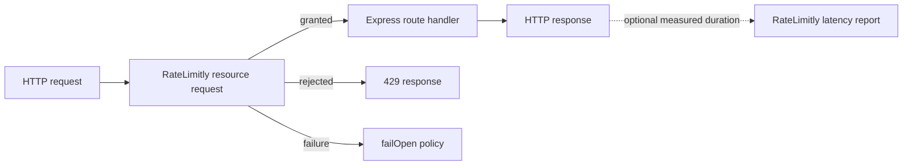

# RateLimitly Express

Express middleware for [RateLimitly](https://ratelimitly.com/).

[](https://github.com/ratelimitly-com/rl-express/actions/workflows/ci.yml)
[](LICENSE)

## What RateLimitly does

RateLimitly helps an application decide whether work should begin. A single
resource request can combine:

- resource consumption, such as “get me one token from the `checkout` rate
  bucket”; and
- latency guards, such as “continue only while the recent latency of
  `inventory` is below 200 ms.”

RateLimitly evaluates the complete request atomically. The result is one of:

- **granted** — every guard passed and the requested resource tokens were
  consumed;
- **rejected** — at least one guard or resource condition was not satisfied,
  and no resource tokens were consumed; or
- **failure** — no admission decision could be obtained, for example because
  of a network or authentication problem. A failure is neither a grant nor a
  rejection.

A latency report is a separate operation. It records an observed latency for a
named service so that later resource requests can guard on that service. An
application may use resource requests, latency reports, or both.

`ratelimitly-express` maps these operations to Express middleware:



## Install

```bash
npm install ratelimitly-express
```

Set the API key issued by RateLimitly:

```bash
export RATELIMITLY_AUTH_KEY='rl-aes1...'
```

## Three small examples

### Consume one token

This middleware asks for one token from the `checkout` resource, whose rate is
100 tokens per second. The route runs only when the request is granted.

```javascript
const express = require('express');
const { rateLimitly, resource } = require('ratelimitly-express');

const app = express();

app.post('/checkout', rateLimitly({
  resources: [
    resource(
      'checkout', // Stable resource name shared by every client.
      '1s',       // Rate-counter window.
      100,        // Tokens available in each window.
      1           // Tokens requested by this HTTP request.
    )
  ],
  failOpen: false // Return a service error when no decision is available.
}), (req, res) => {
  res.json({ accepted: true });
});
```

By default, rejection produces HTTP 429. With `failOpen: false`, a RateLimitly
failure produces HTTP 503; with `failOpen: true`, the middleware calls `next()`
and records `{ outcome: 'fail-open', admitted: true }` on `req.rateLimitly`.
This is not represented as a grant because no RateLimitly decision was
received.

### Report one service latency

This middleware measures how long the route takes and, after the response is
finished, reports the sample for the `inventory` service. Reporting does not
make an admission decision for the current request.

```javascript
const { latencyReporter, latencyTracker } = require('ratelimitly-express');

const inventoryLatency = latencyTracker(
  'inventory', // Stable name; up to 255 UTF-8 bytes.
  {
    ttlMs: '5m',            // How long samples remain relevant.
    maxSamples: 20,         // Requested logical sample count.
    minSampleThreshold: 5   // Minimum insertion rate for a reliable minimum.
  }
);

app.get('/inventory', latencyReporter({
  tracker: inventoryLatency,
  onLatencyReportError(error, req, res) {
    console.error('RateLimitly latency report failed', error);
  }
}), async (req, res) => {
  const items = await loadInventory();
  res.json(items);
});
```

### Guard and consume atomically

This request asks for one `checkout` token only when recent `inventory`
latency is below 200 ms. The guard and the resource consumption form one
atomic admission request.

```javascript
const { guard, latencyTracker } = require('ratelimitly-express');

const inventoryLatency = latencyTracker('inventory', {
  ttlMs: '5m',
  maxSamples: 20,
  minSampleThreshold: 5
});

app.post('/guarded-checkout', rateLimitly({
  resources: [resource('checkout', '1s', 100, 1)],
  guards: [
    guard(
      inventoryLatency, // Exact tracker identity inspected by this guard.
      200               // Maximum acceptable latency, in milliseconds.
    )
  ],
  failOpen: false
}), checkoutHandler);
```

Latency reports for `inventory` may come from this process or from another
client. They are independent of the guarded resource request.

Create a tracker once and reuse it for every corresponding guard and report.
Its name, TTL, sample count, and minimum-sample threshold together define its
identity. The middleware rejects implicit route-derived names and does not
support `reportLatency: true`.

Tracker configuration has no `bufferSize` option. `maxSamples` is part of the
tracker identity and is not rewritten to fit a credential. The server's
effective retained capacity is
`min(API-key latency_buffer_size_max, tracker maxSamples)`.

## Configuration and API

The examples above intentionally show the application-level operations first.
For client ownership, failure policy, request context, headers, convenience
helpers, latency reporting, and TypeScript types, see the
[API guide](docs/api.md).

The transport and high-availability policy are implemented by
[`ratelimitly-client`](https://github.com/ratelimitly-com/rl-js-client). Pass an
initialized client when the application needs to configure or own that layer.

## Runnable examples

The repository contains a small application and focused examples:

- [sample application](https://github.com/ratelimitly-com/rl-express/blob/main/examples/sample_app.js)
- [sample application guide](https://github.com/ratelimitly-com/rl-express/blob/main/examples/sample_app.md)
- [resource request](https://github.com/ratelimitly-com/rl-express/blob/main/examples/basic.js)
- [latency guard and report](https://github.com/ratelimitly-com/rl-express/blob/main/examples/guards.js)
- [multi-resource request](https://github.com/ratelimitly-com/rl-express/blob/main/examples/multi_resource.js)

After cloning the repository and installing dependencies:

```bash
RATELIMITLY_AUTH_KEY='rl-aes1...' node examples/sample_app.js
bash scripts/test-rate-limit.sh
bash scripts/demo-guard.sh
```

## Development

Requires Node.js 20 or newer. Express 4 or newer is supported.

```bash
npm install
npm test
npm run test:package
```

`npm run test:unit` exercises middleware behavior with in-process client
doubles. `npm run test:integration` also sends a real UDP packet through the
published `ratelimitly-client` to a deliberately small synthetic responder on
the loopback interface. That public wire-contract test covers grant and
rejection without credentials, DNS, a production service, or private server
code; the responder is a test fixture, not an alternative RateLimitly server.

Contributions are welcome; see [`CONTRIBUTING.md`](CONTRIBUTING.md) for the
development and review gates. Report suspected vulnerabilities privately by
following [`SECURITY.md`](SECURITY.md). Release-visible changes are recorded in
[`CHANGELOG.md`](CHANGELOG.md). Maintainers should follow the verified
[`RELEASING.md`](RELEASING.md) procedure.

## License

[MIT](LICENSE)
